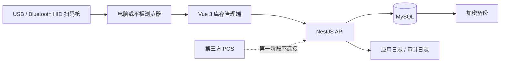
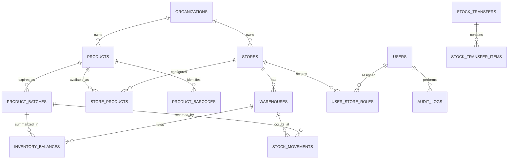
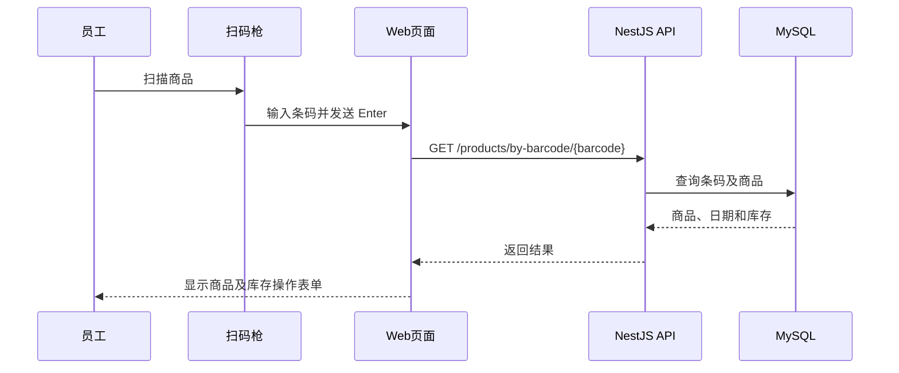

# 02 — Technical Design

项目：Sunshine Inventory Management System  
文档状态：Foundation Implemented
更新日期：2026-07-31

## 1. 设计目标

建立独立于第三方 POS 的外挂库存系统。第一阶段运行一个门店和一个仓库，但数据模型和权限从一开始支持多门店、多仓库和跨店调拨。

现有 SunShineNewStore 电商代码保留。新库存系统建议作为独立模块开发，稳定后再为网页、小程序和统一管理端提供库存 API。

## 2. 推荐技术栈

| 层 | 技术 | 用途 |
| --- | --- | --- |
| 语言 | TypeScript | 前后端统一类型 |
| 后端 | NestJS | API、权限、事务、日志 |
| 管理端 | Vue 3 + Vite + Element Plus | 电脑和平板管理页面 |
| 数据库 | MySQL 8.4 LTS | 商品、日期、流水和权限 |
| ORM | Prisma | Schema、migration 和类型 |
| API 文档 | OpenAPI/Swagger | 接口契约 |
| 测试 | Jest、Supertest、Playwright | 单元、API 和端到端测试 |
| 容器 | Docker Compose | 本地、测试和门店部署 |
| Redis | 第一阶段不启用 | 后续任务队列和缓存 |

## 3. 建议目录

```text
newSunShinestore/
├── inventory-system/
│   ├── apps/
│   │   ├── api/
│   │   └── admin-web/
│   ├── packages/
│   │   ├── database/
│   │   └── shared-types/
│   ├── tests/
│   ├── docker-compose.yml
│   ├── .env.example
│   └── README.md
├── backend/        现有电商后端，保留
├── frontend/       现有电商前端，保留
└── docs/
```

`inventory-system/` 已于2026-07-31创建，包含 pnpm workspace、NestJS API、Vue 3 管理端、Prisma 7 Schema、首个 migration 和基础测试。登录、权限服务、库存事务和扫码页面尚未实现。

## 4. 系统架构



扫码枪不需要业务 API 或设备序列号。它以键盘方式把条码输入当前获得焦点的网页输入框，前端收到 Enter 后调用商品查询 API。

## 5. 数据关系概览



完整字段和约束见 `03-Database-Design.md`。

## 6. 扫码流程



前端要求：

- 扫码输入框自动聚焦；
- 查询后恢复焦点；
- 支持键盘手动输入；
- 防止重复 Enter 和重复提交；
- 未找到条码时显示商品草稿入口；
- 扫码过程不保存支付信息。

## 7. 库存一致性

库存写入必须在同一个数据库事务内：

1. 验证用户和仓库权限；
2. 验证商品、条码和到期日期；
3. 锁定或原子更新库存汇总；
4. 验证结果不为负数；
5. 新增不可变库存流水；
6. 更新库存汇总；
7. 新增审计事件；
8. 提交事务；任何步骤失败则全部回滚。

库存流水是事实来源，`inventory_balances` 是查询汇总。系统必须提供重算和对账能力。

## 8. 调拨设计

同仓库以外的库存移动使用调拨单：

```text
DRAFT → APPROVED → IN_TRANSIT → RECEIVED
                       └──────→ CANCELLED（按规则）
```

发出时：

- 来源仓库减少；
- 在途库存增加。

接收时：

- 在途库存减少；
- 目标仓库增加。

第一阶段是否必须接收方确认仍待业务确认。

## 9. 环境

### local

- 开发者 Mac；
- Docker MySQL；
- 模拟商品数据；
- 禁止使用客户数据。

### test

- 独立测试数据库；
- 自动清理测试数据；
- 执行 API 和事务测试。

### staging

- 门店试运行前集成环境；
- 使用脱敏或测试数据；
- 与生产密钥隔离。

### production

- 第一阶段可在门店 Mini PC 局域网部署；
- 每日加密异地备份；
- 数据库端口不暴露公网；
- 后续统一线上系统迁移至新西兰云区域。

## 10. Mac 开发环境检查

检查日期：2026-07-30

| 项目 | 结果 |
| --- | --- |
| macOS | 26.5 |
| CPU 架构 | Apple Silicon `arm64` |
| 可用磁盘 | 约364 GiB |
| Cursor | 已安装 |
| Google Chrome | 已安装 |
| Git | 2.50.1，可用 |
| Node.js | 24.18.1，已安装 |
| npm | 11.16.0，已安装 |
| Docker CLI/Desktop | 29.6.2，已安装并运行 |
| MySQL | 8.4.11，通过 Docker，端口仅绑定 `127.0.0.1:3307` |
| 数据库 GUI | 未确认 |
| API 测试工具 | 未确认 |

开发环境建议：

1. Node.js 24 LTS；
2. Apple Silicon 版本 Docker Desktop；
3. DBeaver、TablePlus 或 MySQL Workbench 之一；
4. Bruno、Postman 或 Insomnia 之一；
5. Cursor 的 Vue、ESLint、Prettier、Prisma 和 Docker 扩展。

MySQL 建议只通过 Docker 运行，不在 macOS 同时安装第二套服务。

2026-07-31补充：系统已安装 Node.js 24.18.1、npm 11.16.0 和 Docker Desktop 29.6.2。MySQL 8.4.11 容器健康运行，初始 migration 已在全新本地数据库成功执行。

## 11. 暂缓设计

- POS API/CSV；
- Redis；
- 具体货架；
- 在线商城；
- 支付；
- 物流；
- 销售大屏；
- AI 客服；
- 多区域和门店离线双向同步。

## 12. 登录与扫码入库实现

- 密码使用 bcrypt 成本因子12保存，不存储明文；
- 登录成功签发8小时 JWT，接口通过 Bearer Token 验证；
- `must_change_password` 标记初始化账号仍在使用临时密码；
- 扫码查询要求仓库 `can_view` 权限，扫码入库要求 `can_receive` 权限；
- 新商品、条码、门店商品启用、到期批次、库存余额、库存流水和审计日志在一个数据库事务中写入；
- 同一商品同一到期日期通过数据库唯一约束合并到同一内部批次；
- 页面 API 默认连接 `http://127.0.0.1:3100/api/v1`，后续部署通过 `VITE_API_BASE_URL` 配置；
- 第一阶段仅允许明确的本机开发页面来源跨域访问。
- 本地开发统一在 `inventory-system/` 运行 `npm run dev`，由Corepack调用项目指定的pnpm，同时启动3100端口API和5174端口管理页面；仅启动前端无法执行查询或入库。

## 13. 商品聚合与手工出库

- `products` 是商品主档，`product_barcodes` 是一对多条码映射；总库存按 `product_id` 聚合，不能按条码分别相加；
- 完全相同的商品名称复用已有商品ID；关键词命中不同名称时由员工明确选择，避免模糊匹配误合并；
- 搜索同时匹配商品名称和条码，返回最多20个商品主档；
- 每个商品返回全部有效条码、各到期日期库存和仓库总库存；
- 上货架出库在事务内使用“余额大于等于出库量”的条件更新，避免并发情况下产生负库存；
- 成功扣减后写入负数 `MANUAL_ISSUE` 流水和审计日志；任何步骤失败则整体回滚。

## 14. 门店身份、入库时间与员工创建

- 入库时间使用 `stock_movements.created_at` 自动生成，API同时返回 `receivedAt`，员工不填写时间；
- 周转分析以入库流水和后续出库流水的时间差为基础；POS未接入前不得称为真实销售速度；
- 登录资料返回员工门店角色，管理页面显示首个授权门店名称；库存接口继续按仓库权限解析实际操作范围；
- 当前 `wf66` 绑定门店ID 1，开发环境显示名为“阳光特产汉密尔顿 City 店”；
- 第一阶段采用一店一个店内账号；新增门店时由管理员工具创建该店账号，并建立对应 `user_store_roles`、`user_warehouse_permissions`；
- 不增加公共员工注册接口，也不让店内账号自行切换到其他门店；
- 一店一个账号会降低个人操作审计精度，当前审计只能追踪到门店账号；后续如有需要可扩展为一人一账号而不修改库存模型；
- 店内账号密码只以bcrypt哈希存在数据库中，不写入Git文件或文档。

## 15. 管理端视觉规范

- 使用阳光特产 Logo，资源位于管理端 `public/`；
- 健康绿色为主色，橙色只用于品牌点缀；背景使用低对比网格和柔和渐变；
- 入库、出库、查询切换使用约200ms淡入和水平位移动画；
- 支持 `prefers-reduced-motion`，用户要求减少动画时基本关闭过渡；
- 动画不能阻塞扫码、键盘操作或库存请求。
- 常见USB扫码枪以HID键盘模式接入，不需要设备API、ID或序列号；页面监听条码文本和Enter后缀；
- 页面加载和切换模式后自动聚焦扫码输入框，并根据真实焦点显示“扫码输入就绪”；无法通过浏览器焦点状态判断具体USB设备是否已连接。

## 16. 管理员悬浮小工具路线

### 阶段A：PWA小窗口

- 为现有Vue管理端增加Web App Manifest、图标和安装入口；
- 安装后从桌面独立窗口启动，继续访问同一NestJS API；
- 工作量小，适合先验证紧凑查询界面，但跨平台“始终置顶”能力有限。

### 阶段B：Tauri桌面壳

- 使用Tauri承载现有Vue构建产物，不重写业务页面；
- 默认窗口约420×680，可调整大小，并支持置顶、系统托盘和全局快捷键；
- 小工具只保存短期会话Token，不包含MySQL账号，不直接连接数据库；
- 所有查询和库存操作仍通过HTTPS/局域网NestJS API，并继续执行门店、仓库和角色权限；
- USB扫码枪仍以HID键盘方式输入，窗口获得焦点后直接扫码；如需全局扫码必须单独评估操作系统权限。

### 推荐顺序

先完成当前库存MVP和门店试用，再做PWA紧凑模式；确认管理员确实需要始终置顶后再加入Tauri，避免过早维护Windows/macOS安装包和自动更新。

## 17. 入库单与报表实现

- `stock_receipts` 是一次点货任务的单头，状态为 `OPEN / COMPLETED / CANCELLED`；
- `stock_receipt_items` 保存每次扫码明细，并通过唯一 `movement_id` 关联不可变库存流水；
- 扫码入库事务同时写入余额、流水、入库单明细和审计日志，任一步失败整体回滚；
- 完成入库单只封闭单据，不修改历史库存流水；之后的新入库自动建立新单；
- 报表 API 只返回当前员工有 `can_view` 权限的仓库，不能由前端传入任意仓库ID；
- CSV在浏览器本地生成，不向第三方发送库存数据，并防护Excel公式注入字符。

## 18. 临期库存预警实现

- 临期页作为“记录与报表”的第三个子页面，主工作台仍保持入库、出库、查询、记录与报表四类；
- API依据企业时区计算当天日期，只查询当前员工有 `can_view` 权限仓库中数量大于0的库存余额；
- 默认按 `EXPIRED`、2个月内 `URGENT`、超过2月至3个月 `WARNING`、超过3月至6个月 `EARLY` 互斥归类；
- 到期日期只标年月的批次内部以月末参与计算，但页面和CSV保持 `YYYY-MM`，不伪造具体日；
- 商品关键词/条码在数据库查询阶段过滤，等级筛选只过滤明细，顶部汇总保留当前关键词范围的完整分布；
- CSV仅在浏览器生成，沿用公式注入防护，不上传库存数据。

## 19. 盘点与库存流水实现

- `GET /inventory/movements` 仅返回当前账号有查看权限仓库的最近100条流水，并支持商品、条码或流水号过滤；
- `POST /inventory/stocktake-adjustment` 要求仓库 `can_count` 权限；
- 盘点事务先读取当前余额与版本，使用条件更新写入实际数量，版本冲突时整体回滚并提示重新查询；
- 差异为正写 `STOCKTAKE_GAIN`，差异为负写 `STOCKTAKE_LOSS`，差异为0拒绝写入；
- 余额更新、库存流水和审计日志在同一事务完成，历史流水保持不可变；
- 页面将盘点和最近流水放在同一个报表子页，避免增加主导航复杂度。

## 20. Light / Dark 液态玻璃主题

- 管理端使用CSS变量统一维护页面、文字、玻璃层、边框、阴影和品牌渐变，业务组件不复制两套；
- Light主题使用参考图方向的银灰雾面底与透明薄荷绿玻璃，Dark主题使用深蓝黑底与透明墨绿色玻璃，并保留青绿色主光和少量紫色边缘光；
- 主题按钮同时出现在登录页和工作台，选择保存到浏览器 `localStorage`，首次访问跟随系统深浅偏好；
- 两种主题均保留阳光特产Logo和橙色品牌点缀，霓虹只用于边缘、聚焦和当前操作，不影响库存数据阅读；
- 960px以下将账户区和四个主操作改为两列布局，720px以下继续使用单列，避免平板和小窗口横向溢出；
- 继续尊重 `prefers-reduced-motion`，主题切换不改变扫码、库存事务或API行为。
