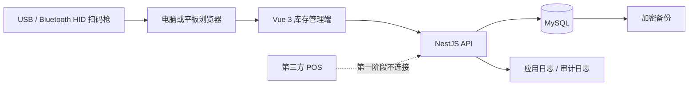
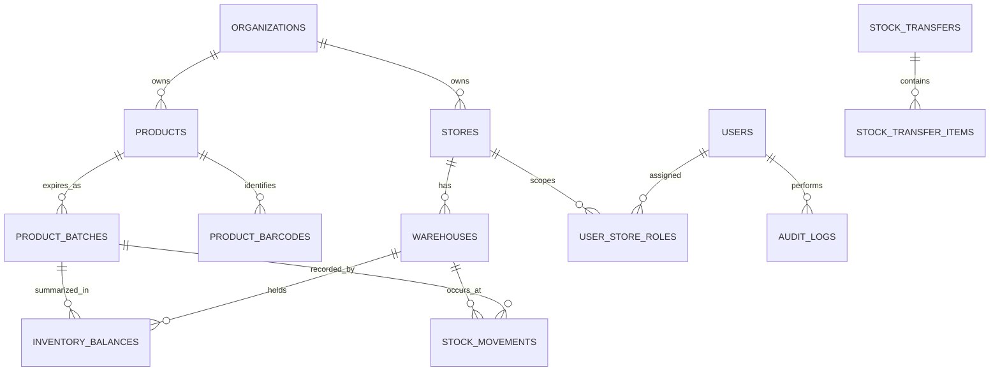
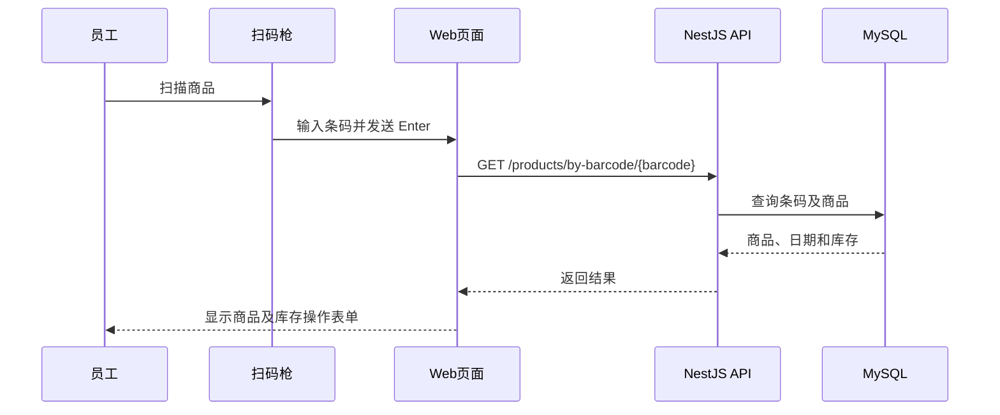

# 02 — Technical Design

项目：Sunshine Inventory Management System  
文档状态：Draft Baseline  
更新日期：2026-07-30

## 1. 设计目标

建立独立于第三方 POS 的外挂库存系统。第一阶段运行一个门店和一个仓库，但数据模型和权限从一开始支持多门店、多仓库和跨店调拨。

现有 SunShineNewStore 电商代码保留。新库存系统建议作为独立模块开发，稳定后再为网页、小程序和统一管理端提供库存 API。

## 2. 推荐技术栈

| 层 | 技术 | 用途 |
| --- | --- | --- |
| 语言 | TypeScript | 前后端统一类型 |
| 后端 | NestJS | API、权限、事务、日志 |
| 管理端 | Vue 3 + Vite + Element Plus | 电脑和平板管理页面 |
| 数据库 | MySQL 8.4 LTS | 商品、日期、流水和权限 |
| ORM | Prisma | Schema、migration 和类型 |
| API 文档 | OpenAPI/Swagger | 接口契约 |
| 测试 | Jest、Supertest、Playwright | 单元、API 和端到端测试 |
| 容器 | Docker Compose | 本地、测试和门店部署 |
| Redis | 第一阶段不启用 | 后续任务队列和缓存 |

## 3. 建议目录

```text
newSunShinestore/
├── inventory-system/
│   ├── apps/
│   │   ├── api/
│   │   └── admin-web/
│   ├── packages/
│   │   ├── database/
│   │   └── shared-types/
│   ├── tests/
│   ├── docker-compose.yml
│   ├── .env.example
│   └── README.md
├── backend/        现有电商后端，保留
├── frontend/       现有电商前端，保留
└── docs/
```

本次仅确认设计，不创建 `inventory-system/` 代码。

## 4. 系统架构



扫码枪不需要业务 API 或设备序列号。它以键盘方式把条码输入当前获得焦点的网页输入框，前端收到 Enter 后调用商品查询 API。

## 5. 数据关系概览



完整字段和约束见 `03-Database-Design.md`。

## 6. 扫码流程



前端要求：

- 扫码输入框自动聚焦；
- 查询后恢复焦点；
- 支持键盘手动输入；
- 防止重复 Enter 和重复提交；
- 未找到条码时显示商品草稿入口；
- 扫码过程不保存支付信息。

## 7. 库存一致性

库存写入必须在同一个数据库事务内：

1. 验证用户和仓库权限；
2. 验证商品、条码和到期日期；
3. 锁定或原子更新库存汇总；
4. 验证结果不为负数；
5. 新增不可变库存流水；
6. 更新库存汇总；
7. 新增审计事件；
8. 提交事务；任何步骤失败则全部回滚。

库存流水是事实来源，`inventory_balances` 是查询汇总。系统必须提供重算和对账能力。

## 8. 调拨设计

同仓库以外的库存移动使用调拨单：

```text
DRAFT → APPROVED → IN_TRANSIT → RECEIVED
                       └──────→ CANCELLED（按规则）
```

发出时：

- 来源仓库减少；
- 在途库存增加。

接收时：

- 在途库存减少；
- 目标仓库增加。

第一阶段是否必须接收方确认仍待业务确认。

## 9. 环境

### local

- 开发者 Mac；
- Docker MySQL；
- 模拟商品数据；
- 禁止使用客户数据。

### test

- 独立测试数据库；
- 自动清理测试数据；
- 执行 API 和事务测试。

### staging

- 门店试运行前集成环境；
- 使用脱敏或测试数据；
- 与生产密钥隔离。

### production

- 第一阶段可在门店 Mini PC 局域网部署；
- 每日加密异地备份；
- 数据库端口不暴露公网；
- 后续统一线上系统迁移至新西兰云区域。

## 10. Mac 开发环境检查

检查日期：2026-07-30

| 项目 | 结果 |
| --- | --- |
| macOS | 26.5 |
| CPU 架构 | Apple Silicon `arm64` |
| 可用磁盘 | 约364 GiB |
| Cursor | 已安装 |
| Google Chrome | 已安装 |
| Git | 2.50.1，可用 |
| Node.js | 未找到 |
| npm | 未找到 |
| Docker CLI/Desktop | 未找到 |
| MySQL CLI | 未找到 |
| 数据库 GUI | 未确认 |
| API 测试工具 | 未确认 |

开始编码前需要安装：

1. Node.js 24 LTS，建议通过 `nvm` 或 `fnm`；
2. Apple Silicon 版本 Docker Desktop；
3. DBeaver、TablePlus 或 MySQL Workbench 之一；
4. Bruno、Postman 或 Insomnia 之一；
5. Cursor 的 Vue、ESLint、Prettier、Prisma 和 Docker 扩展。

MySQL 建议只通过 Docker 运行，不在 macOS 同时安装第二套服务。

## 11. 暂缓设计

- POS API/CSV；
- Redis；
- 具体货架；
- 在线商城；
- 支付；
- 物流；
- 销售大屏；
- AI 客服；
- 多区域和门店离线双向同步。
