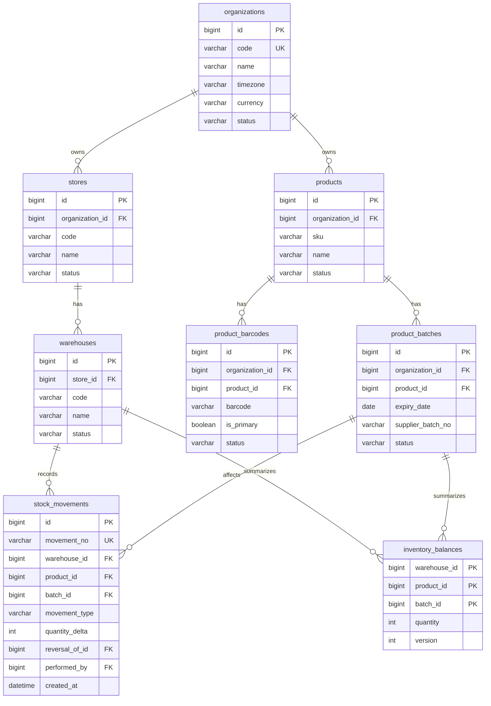

# 03 — Database Design

项目：Sunshine Inventory Management System  
文档状态：Draft Baseline，尚未创建 migration  
更新日期：2026-07-30

## 1. 原则

- 第一阶段启用一个门店和一个仓库，结构支持未来多门店；
- 商品按件计数；
- 商品与条码一对多；
- 商品与到期日期记录一对多；
- 供应商批次号可空，系统始终生成内部 ID；
- 库存流水是事实来源；
- 库存汇总用于快速查询；
- 历史流水不直接删除或覆盖；
- 关键唯一性和完整性由数据库约束保证；
- 所有业务表包含企业范围，防止未来多组织数据串用。

## 2. ER 图



## 3. 核心表

### 3.1 `organizations`

| 字段 | 类型 | 规则 |
| --- | --- | --- |
| `id` | BIGINT | 主键 |
| `code` | VARCHAR(32) | 唯一、不可变业务代码 |
| `name` | VARCHAR(120) | 公司名称 |
| `timezone` | VARCHAR(64) | 默认 `Pacific/Auckland` |
| `currency` | CHAR(3) | 默认 `NZD` |
| `status` | VARCHAR(20) | `active/inactive` |
| `created_at` | DATETIME | 创建时间 |
| `updated_at` | DATETIME | 更新时间 |

### 3.2 `stores`

唯一约束：`(organization_id, code)`。

字段包括：

- `id`
- `organization_id`
- `code`
- `name`
- `address`
- `status`
- `created_at`
- `updated_at`

### 3.3 `warehouses`

唯一约束：`(store_id, code)`。

字段包括：

- `id`
- `store_id`
- `code`
- `name`
- `status`
- `created_at`
- `updated_at`

第一阶段不建立货架表。

### 3.4 `products`

| 字段 | 类型 | 规则 |
| --- | --- | --- |
| `id` | BIGINT | 主键 |
| `organization_id` | BIGINT | 企业范围 |
| `sku` | VARCHAR(64) | 企业内唯一，可系统生成 |
| `name` | VARCHAR(255) | 必填 |
| `description` | TEXT | 可选 |
| `unit` | VARCHAR(20) | 第一阶段固定 `piece` |
| `status` | VARCHAR(20) | `active/inactive` |
| `created_by` | BIGINT | 操作人 |
| `created_at` | DATETIME | 创建时间 |
| `updated_at` | DATETIME | 更新时间 |

唯一约束：`(organization_id, sku)`。

供应商和采购价格第一阶段不作为必填字段。后续可增加权限受控的采购模块。

### 3.5 `product_barcodes`

| 字段 | 类型 | 规则 |
| --- | --- | --- |
| `id` | BIGINT | 主键 |
| `organization_id` | BIGINT | 企业范围 |
| `product_id` | BIGINT | 所属商品 |
| `barcode` | VARCHAR(128) | 保留字符串，不转数值 |
| `barcode_type` | VARCHAR(30) | 可选 |
| `is_primary` | BOOLEAN | 主条码 |
| `status` | VARCHAR(20) | `active/inactive` |
| `created_at` | DATETIME | 创建时间 |

唯一约束：`(organization_id, barcode)`。

条码必须使用字符串保存，避免前导零丢失。

### 3.6 `product_batches`

员工无需填写批次号，系统用内部 `id` 区分记录。

| 字段 | 类型 | 规则 |
| --- | --- | --- |
| `id` | BIGINT | 主键 |
| `organization_id` | BIGINT | 企业范围 |
| `product_id` | BIGINT | 所属商品 |
| `expiry_date` | DATE | 必填 |
| `supplier_batch_no` | VARCHAR(100) | 可空 |
| `status` | VARCHAR(20) | `active/expired/quarantined` |
| `created_by` | BIGINT | 操作人 |
| `created_at` | DATETIME | 创建时间 |

第一阶段建议唯一约束：`(organization_id, product_id, expiry_date)`，即同一商品和同一日期合并为一个内部批次。

### 3.7 `stock_movements`

| 字段 | 类型 | 规则 |
| --- | --- | --- |
| `id` | BIGINT | 主键 |
| `movement_no` | VARCHAR(40) | 唯一业务编号 |
| `organization_id` | BIGINT | 企业范围 |
| `store_id` | BIGINT | 门店 |
| `warehouse_id` | BIGINT | 仓库 |
| `product_id` | BIGINT | 商品 |
| `batch_id` | BIGINT | 到期日期记录 |
| `movement_type` | VARCHAR(30) | 流水类型 |
| `quantity_delta` | INT | 正数增加、负数减少，禁止0 |
| `reference_type` | VARCHAR(30) | 来源类型 |
| `reference_id` | BIGINT | 来源记录 |
| `reason` | VARCHAR(255) | 手工调整等必填 |
| `reversal_of_id` | BIGINT | 冲销原流水，可空 |
| `performed_by` | BIGINT | 操作员工 |
| `idempotency_key` | VARCHAR(64) | 防重复提交 |
| `created_at` | DATETIME | 不可变创建时间 |

约束：

- `quantity_delta <> 0`；
- `idempotency_key` 在企业范围内唯一；
- 冲销流水指向原流水；
- 普通业务禁止 UPDATE/DELETE 历史流水。

### 3.8 `inventory_balances`

复合主键：

```text
(organization_id, warehouse_id, product_id, batch_id)
```

字段：

- `quantity INT NOT NULL`
- `version INT NOT NULL`
- `updated_at DATETIME`

`version` 用于并发控制。正常出库后数量不得小于零。

### 3.9 用户与权限

建议表：

```text
users
roles
permissions
role_permissions
user_store_roles
user_warehouse_permissions
```

`user_warehouse_permissions` 可包含：

- `can_view`
- `can_receive`
- `can_issue`
- `can_transfer`
- `can_count`

### 3.10 调拨

```text
stock_transfers
stock_transfer_items
```

`stock_transfers`：

- `from_warehouse_id`
- `to_warehouse_id`
- `status`
- `requested_by`
- `dispatched_by`
- `received_by`
- `dispatched_at`
- `received_at`

`stock_transfer_items`：

- `transfer_id`
- `product_id`
- `batch_id`
- `quantity`

### 3.11 临期配置

```text
expiry_alert_settings
├── organization_id
├── early_warning_months = 7
├── warning_months = 6
├── urgent_months = 3
├── early_warning_label = 提前关注
├── warning_label = 临期预警
└── urgent_label = 紧急处理
```

### 3.12 审计

`audit_logs` 记录：

- 用户；
- 行为；
- 实体类型和 ID；
- 门店/仓库；
- 请求追踪 ID；
- 变更前后摘要；
- 时间；
- IP/终端信息（不保存敏感支付信息）。

## 4. 库存流水类型

| 类型 | 数量方向 | 第一阶段 | 说明 |
| --- | ---: | ---: | --- |
| `INITIAL_STOCK` | + | 是 | 初始库存 |
| `RECEIPT` | + | 是 | 手工收货入库 |
| `MANUAL_ISSUE` | - | 是 | 暂不连接 POS 的手工出库；用 `reference_type/reason` 区分货架补货等用途 |
| `TRANSFER_OUT` | - | 是 | 调拨发出 |
| `TRANSFER_IN` | + | 是 | 调拨接收 |
| `STOCKTAKE_GAIN` | + | 是 | 盘盈 |
| `STOCKTAKE_LOSS` | - | 是 | 盘亏 |
| `DAMAGE` | - | 是 | 破损 |
| `EXPIRED` | - | 是 | 过期处理 |
| `RETURN_IN` | + | 是 | 可重新销售的退货入库 |
| `RETURN_TO_SUPPLIER` | - | 可选 | 退供应商 |
| `REVERSAL` | 正/负 | 是 | 冲销错误流水 |
| `POS_SALE` | - | 后续 | POS 同步销售 |
| `ONLINE_SALE` | - | 后续 | 网页/小程序销售 |

第一阶段从仓库拿到未被系统追踪的货架时：

```text
movement_type = MANUAL_ISSUE
reference_type = SHELF_REPLENISHMENT
```

这不是销售流水。第一阶段库存汇总只代表受系统管理的仓库库存，不代表门店货架与仓库的合计库存。

## 5. 关键索引

- `product_barcodes(organization_id, barcode)` 唯一索引；
- `product_batches(organization_id, product_id, expiry_date)` 唯一索引；
- `inventory_balances(warehouse_id, product_id, batch_id)` 主键；
- `stock_movements(organization_id, created_at)`；
- `stock_movements(product_id, batch_id, created_at)`；
- `product_batches(expiry_date, status)`；
- `stock_transfers(from_warehouse_id, status)`；
- `stock_transfers(to_warehouse_id, status)`。

## 6. 临期查询

临期查询基于：

- `product_batches.expiry_date`；
- `inventory_balances.quantity > 0`；
- 企业临期配置；
- 当前企业时区的日期。

已过期且仍有库存必须单独列出，不与普通临期提示混合。

## 7. migration 状态

本文件只完成逻辑设计，尚未：

- 创建 Prisma Schema；
- 创建 migration；
- 连接 MySQL；
- 创建 seed；
- 执行升级或回滚测试。

因此数据库状态为“设计完成初稿，尚未实施”。
