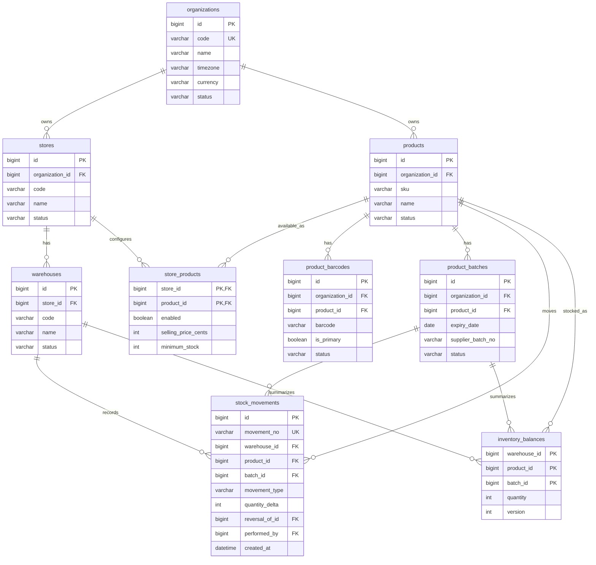

# 03 — Database Design

项目：Sunshine Inventory Management System  
文档状态：Schema and Initial Migration Implemented
更新日期：2026-08-01

## 1. 原则

- 第一阶段启用一个门店和一个仓库，结构支持未来多门店；
- 商品按件计数；
- 商品与条码一对多；
- 商品与到期日期记录一对多；
- 供应商批次号可空，系统始终生成内部 ID；
- 库存流水是事实来源；
- 库存汇总用于快速查询；
- 历史流水不直接删除或覆盖；
- 关键唯一性和完整性由数据库约束保证；
- 所有业务表包含企业范围，防止未来多组织数据串用。

## 2. ER 图



## 3. 核心表

### 3.1 `organizations`

| 字段 | 类型 | 规则 |
| --- | --- | --- |
| `id` | BIGINT | 主键 |
| `code` | VARCHAR(32) | 唯一、不可变业务代码 |
| `name` | VARCHAR(120) | 公司名称 |
| `timezone` | VARCHAR(64) | 默认 `Pacific/Auckland` |
| `currency` | CHAR(3) | 默认 `NZD` |
| `status` | VARCHAR(20) | `active/inactive` |
| `created_at` | DATETIME | 创建时间 |
| `updated_at` | DATETIME | 更新时间 |

### 3.2 `stores`

唯一约束：`(organization_id, code)`。

字段包括：

- `id`
- `organization_id`
- `code`
- `name`
- `address`
- `status`
- `created_at`
- `updated_at`

### 3.3 `warehouses`

唯一约束：`(store_id, code)`。

字段包括：

- `id`
- `store_id`
- `code`
- `name`
- `status`
- `created_at`
- `updated_at`

第一阶段不建立货架表。

### 3.4 `products`

| 字段 | 类型 | 规则 |
| --- | --- | --- |
| `id` | BIGINT | 主键 |
| `organization_id` | BIGINT | 企业范围 |
| `sku` | VARCHAR(64) | 企业内唯一，可系统生成 |
| `name` | VARCHAR(255) | 必填 |
| `description` | TEXT | 可选 |
| `unit` | VARCHAR(20) | 第一阶段固定 `piece` |
| `status` | VARCHAR(20) | `active/inactive` |
| `created_by` | BIGINT | 操作人 |
| `created_at` | DATETIME | 创建时间 |
| `updated_at` | DATETIME | 更新时间 |

唯一约束：`(organization_id, sku)`。

供应商和采购价格第一阶段不作为必填字段。后续可增加权限受控的采购模块。

### 3.5 `product_barcodes`

| 字段 | 类型 | 规则 |
| --- | --- | --- |
| `id` | BIGINT | 主键 |
| `organization_id` | BIGINT | 企业范围 |
| `product_id` | BIGINT | 所属商品 |
| `barcode` | VARCHAR(128) | 保留字符串，不转数值 |
| `barcode_type` | VARCHAR(30) | 可选 |
| `is_primary` | BOOLEAN | 主条码 |
| `status` | VARCHAR(20) | `active/inactive` |
| `created_at` | DATETIME | 创建时间 |

唯一约束：`(organization_id, barcode)`。

条码必须使用字符串保存，避免前导零丢失。

### 3.5A `store_products`

门店和商品为多对多关系。商品主档属于企业，门店不复制商品，而是在此表保存门店级设置：

- `store_id`
- `product_id`
- `enabled`
- `selling_price_cents`（可空，使用整数分避免浮点金额）
- `minimum_stock`（可空）

复合主键：`(store_id, product_id)`。库存数量不保存在此表，仍由仓库、商品、到期批次和库存流水计算。

### 3.6 `product_batches`

员工无需填写批次号，系统用内部 `id` 区分记录。

| 字段 | 类型 | 规则 |
| --- | --- | --- |
| `id` | BIGINT | 主键 |
| `organization_id` | BIGINT | 企业范围 |
| `product_id` | BIGINT | 所属商品 |
| `expiry_date` | DATE | 必填；只知道年月时内部使用该月最后一天计算临期 |
| `expiry_precision` | ENUM | `MONTH`=只知道年月，`DATE`=完整日期 |
| `supplier_batch_no` | VARCHAR(100) | 可空 |
| `status` | VARCHAR(20) | `active/expired/quarantined` |
| `created_by` | BIGINT | 操作人 |
| `created_at` | DATETIME | 创建时间 |

唯一约束：`(organization_id, product_id, expiry_date, expiry_precision)`。月份精度和完整日期分开保存，API 在 `MONTH` 精度下只返回 `YYYY-MM`，不得向员工显示内部计算日。

商品名称完全相同、但条码或到期日期不同的记录应使用同一个 `products.id`。条码保存在 `product_barcodes`，日期库存保存在 `product_batches`；总库存为该商品全部日期余额之和，不为每个条码创建独立商品主档。

### 3.7 `stock_movements`

| 字段 | 类型 | 规则 |
| --- | --- | --- |
| `id` | BIGINT | 主键 |
| `movement_no` | VARCHAR(40) | 唯一业务编号 |
| `organization_id` | BIGINT | 企业范围 |
| `store_id` | BIGINT | 门店 |
| `warehouse_id` | BIGINT | 仓库 |
| `product_id` | BIGINT | 商品 |
| `batch_id` | BIGINT | 到期日期记录 |
| `movement_type` | VARCHAR(30) | 流水类型 |
| `quantity_delta` | INT | 正数增加、负数减少，禁止0 |
| `reference_type` | VARCHAR(30) | 来源类型 |
| `reference_id` | BIGINT | 来源记录 |
| `reason` | VARCHAR(255) | 手工调整等必填 |
| `reversal_of_id` | BIGINT | 冲销原流水，可空 |
| `performed_by` | BIGINT | 操作员工 |
| `idempotency_key` | VARCHAR(64) | 防重复提交 |
| `created_at` | DATETIME | 不可变创建时间 |

约束：

- `quantity_delta <> 0`；
- `idempotency_key` 在企业范围内唯一；
- 冲销流水指向原流水；
- 普通业务禁止 UPDATE/DELETE 历史流水。

### 3.8 `inventory_balances`

复合主键：

```text
(organization_id, warehouse_id, product_id, batch_id)
```

字段：

- `quantity INT NOT NULL`
- `version INT NOT NULL`
- `updated_at DATETIME`

`version` 用于并发控制。正常出库后数量不得小于零。

### 3.9 用户与权限

建议表：

```text
users
roles
permissions
role_permissions
user_store_roles
user_warehouse_permissions
```

`user_warehouse_permissions` 可包含：

- `can_view`
- `can_receive`
- `can_issue`
- `can_transfer`
- `can_count`

### 3.10 调拨

```text
stock_transfers
stock_transfer_items
```

`stock_transfers`：

- `from_warehouse_id`
- `to_warehouse_id`
- `status`
- `requested_by`
- `dispatched_by`
- `received_by`
- `dispatched_at`
- `received_at`

`stock_transfer_items`：

- `transfer_id`
- `product_id`
- `batch_id`
- `quantity`

### 3.11 临期配置

```text
expiry_alert_settings
├── organization_id
├── early_warning_months = 6
├── warning_months = 3
├── urgent_months = 2
├── early_warning_label = 提前关注
├── warning_label = 临期预警
├── urgent_label = 紧急临期
└── expired_label = 已过期
```

### 3.12 审计

`audit_logs` 记录：

- 用户；
- 行为；
- 实体类型和 ID；
- 门店/仓库；
- 请求追踪 ID；
- 变更前后摘要；
- 时间；
- IP/终端信息（不保存敏感支付信息）。

## 4. 库存流水类型

| 类型 | 数量方向 | 第一阶段 | 说明 |
| --- | ---: | ---: | --- |
| `INITIAL_STOCK` | + | 是 | 初始库存 |
| `RECEIPT` | + | 是 | 手工收货入库 |
| `MANUAL_ISSUE` | - | 是 | 暂不连接 POS 的手工出库；用 `reference_type/reason` 区分货架补货等用途 |
| `TRANSFER_OUT` | - | 是 | 调拨发出 |
| `TRANSFER_IN` | + | 是 | 调拨接收 |
| `STOCKTAKE_GAIN` | + | 是 | 盘盈 |
| `STOCKTAKE_LOSS` | - | 是 | 盘亏 |
| `DAMAGE` | - | 是 | 破损 |
| `EXPIRED` | - | 是 | 过期处理 |
| `RETURN_IN` | + | 是 | 可重新销售的退货入库 |
| `RETURN_TO_SUPPLIER` | - | 可选 | 退供应商 |
| `REVERSAL` | 正/负 | 是 | 冲销错误流水 |
| `POS_SALE` | - | 后续 | POS 同步销售 |
| `ONLINE_SALE` | - | 后续 | 网页/小程序销售 |

第一阶段从仓库拿到未被系统追踪的货架时：

```text
movement_type = MANUAL_ISSUE
reference_type = SHELF_REPLENISHMENT
```

这不是销售流水。第一阶段库存汇总只代表受系统管理的仓库库存，不代表门店货架与仓库的合计库存。

## 5. 关键索引

- `product_barcodes(organization_id, barcode)` 唯一索引；
- `product_batches(organization_id, product_id, expiry_date, expiry_precision)` 唯一索引；
- `inventory_balances(warehouse_id, product_id, batch_id)` 主键；
- `stock_movements(organization_id, created_at)`；
- `stock_movements(product_id, batch_id, created_at)`；
- `product_batches(expiry_date, status)`；
- `stock_transfers(from_warehouse_id, status)`；
- `stock_transfers(to_warehouse_id, status)`。

## 6. 临期查询

临期查询基于：

- `product_batches.expiry_date`；
- `inventory_balances.quantity > 0`；
- 企业临期配置；
- 当前企业时区的日期。

已过期且仍有库存必须单独列出，不与普通临期提示混合。

当前默认分级为：到期日小于门店当天日期为 `EXPIRED`；当天至2个月内为 `URGENT`；超过2个月至3个月为 `WARNING`；超过3个月至6个月为 `EARLY`。只查询当前员工有查看权限的仓库及 `quantity > 0` 的余额。只标注到期年月的批次以该月最后一天参与计算，页面仍显示 `YYYY-MM`。

## 7. migration 状态

已完成：

- Prisma 7 Schema；
- 初始 MySQL migration：`202607310001_inventory_foundation`；
- 公司、门店、门店商品配置、仓库、商品、多条码、多日期、权限、流水、余额、调拨、临期设置和审计模型；
- Schema format、validate 和 Client generate；
- 关键模型及唯一约束的契约测试；
- migration 中的数量和临期阈值 CHECK 约束。
- 入库单 migration：`202608010001_stock_receipts_and_reports`；
- 临期默认阈值 migration：`202608010002_expiry_alert_thresholds`，开发库和独立测试库均已应用；
- 临期默认名称 migration：`202608010003_expiry_alert_labels`，开发库和独立测试库均已应用；
- 在 MySQL 8.4.11 容器从空数据库成功应用初始 migration；
- 验证20张数据库表、migration 完成状态和7个 CHECK 约束。

尚未完成：

- migration 回滚/恢复演练；
- 正式开发环境 seed 命令；
- 完整库存事务服务与并发测试；
- 企业范围跨表一致性的服务层校验；
- 调拨来源仓库与目标仓库不得相同的服务层校验（MySQL 不允许在当前外键列上使用该 CHECK）。

## 8. 数据库连接与集成测试

- `@sunshine/database` 提供统一的 Prisma Client 创建方法；
- NestJS `PrismaService` 在模块启动和关闭时连接、释放数据库；
- 开发库使用 `DATABASE_URL`；
- 集成测试使用独立的 `TEST_DATABASE_URL`，数据库名必须以 `_test` 结尾；
- 测试夹具只创建虚构的企业、门店、仓库、员工、商品、条码和到期日期；
- 每项集成测试前按外键顺序清理测试业务表，不关闭外键保护，不处理 `_prisma_migrations`。

已实测：

- 初始 migration 可应用到空测试库；
- Prisma 可真实连接 MySQL 8.4；
- 企业内重复条码被拒绝；
- 同商品、同到期日期的重复批次行被拒绝；
- 负库存汇总被拒绝；
- 事务中流水违反非零约束时，先前的库存汇总写入一并回滚。

## 9. 登录与首个开发账号

第二个 migration：`202607310002_user_password_state`。

- `users.password_hash`：bcrypt 哈希，不保存或返回明文密码；
- `users.must_change_password`：临时密码账号为 `true`；
- 首个开发员工由一次性初始化命令创建，同时建立企业、第一门店、主仓库、管理员角色、门店角色关系和仓库权限；
- 初始化命令发现同名账号时拒绝覆盖，避免意外重置已有密码；
- 临时密码只在命令成功时输出一次，不写入代码、文档、日志模板或 Git。

2026-07-31扫码联调已在开发库产生一条虚构测试商品数据和一条 `RECEIPT` 流水，用于验证页面到数据库的完整链路；上线前必须清理开发测试数据。

## 10. 多条码库存聚合规则

- 一个 `products.id` 可以关联多个 `product_barcodes.barcode`；
- 条码只用于识别商品，不是库存汇总维度；
- 库存维度为 `organization_id + warehouse_id + product_id + batch_id`；
- 商品总数量为该商品所有到期批次 `inventory_balances.quantity` 之和；
- SQL查询同时连接多条码和多批次时会形成笛卡尔重复，报表必须分别聚合或使用子查询，不能直接对连接结果求和；
- 上货架出库写入 `stock_movements.quantity_delta < 0`，并同步减少对应日期的 `inventory_balances.quantity`；
- 上架商品暂不建立货架余额，因此仓库总库存会减少，门店全量可售库存仍不可得。
## 12. Local MySQL 8 authentication

- 本地 Docker MySQL 8 使用 `caching_sha2_password`；容器重启后，本机非 TLS 连接允许驱动读取服务器 RSA 公钥。
- 自动读取公钥只允许 `localhost` 和 `127.0.0.1`，远程数据库必须配置 TLS，不能沿用本地开发设置。

## 13. 入库单模型

第四个 migration：`202608010001_stock_receipts_and_reports`。

- `stock_receipts`：入库单号、门店、仓库、业务日期、状态、创建/完成人和完成时间；
- `stock_receipt_items`：商品、日期批次、实际扫描条码、数量及唯一库存流水；
- 入库单是业务归组，`stock_movements` 仍是库存事实来源；
- 一张入库单可包含多种商品，同商品重复扫描保留多条明细，报表按需汇总；
- migration 已在开发库和名称以 `_test` 结尾的独立测试库成功应用。

## 14. 库存流水撤销约束

- `stock_movements.reversal_of_id` 指向被撤销的原库存流水；
- 该字段具有唯一约束，同一原流水最多关联一笔撤销流水；
- 撤销不修改原流水，而是新增数量相反的 `REVERSAL` 流水并同步更新余额；
- 第一批只撤销 `RECEIPT / MANUAL_ISSUE`，不允许撤销 `REVERSAL`；
- 本批复用既有字段、外键和唯一约束，不新增migration。

## 15. 连续扫码清单的数据边界

- 未确认清单是短期页面状态，不写入数据库，也不新增草稿表；
- 确认后的每一项继续写入 `stock_receipt_items`，并通过唯一 `movement_id` 对应一条不可变 `stock_movements`；
- 同一员工、仓库、业务日期的确认项目归入当前 `OPEN` 入库单；
- 本批不修改数据库结构，不需要新增 migration。
