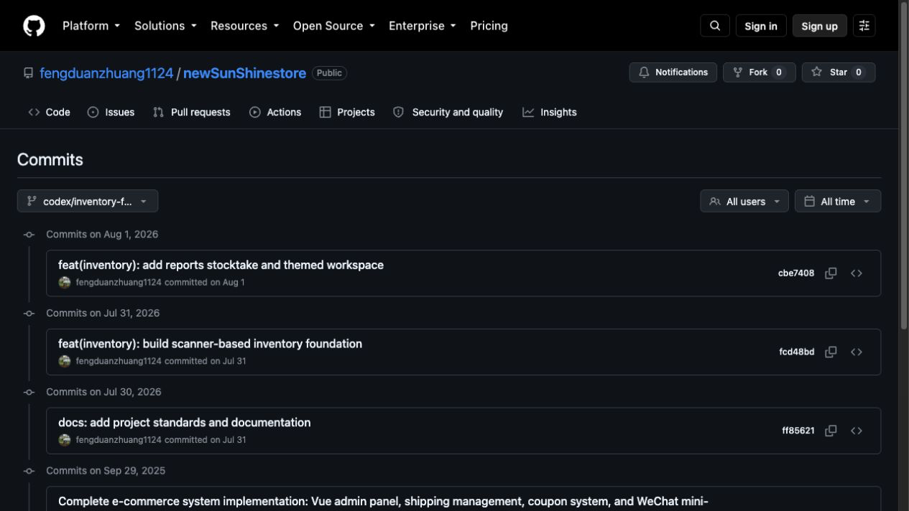

# Sunshine Integrated System Personal Development Workflow and Milestone Record

Record date: 8 September 2026
Time zone: Pacific/Auckland
Record basis: Project code, development documents, file timestamps, local Git history, and GitHub commit records.
Note: This report treats the Sunshine Integrated Retail System as one product and consolidates its design, implementation, progress, and Git records across two code repositories. Committed work and local uncommitted work are identified separately so planned functions are not presented as completed functions.

## 0. Product and repository structure

The Sunshine Integrated Retail System is one complete product. Its code is currently organised into two repositories according to technical responsibility. Both repositories support the same product, order, inventory, and sales-data workflow; they are not separate commercial projects.

```text
Sunshine Integrated Retail System (one product)
|
|-- newSunShinestore
|   |-- Unified inventory centre
|   |-- Read-only Moni POS integration
|   |-- Product mapping and data reporting
|   `-- Inventory operations workspace
|
`-- newsunshine-3
    |-- CRMEB commerce service
    |-- Commerce administration
    |-- H5/desktop web storefront
    `-- WeChat Mini Program
```

The inventory operations workspace supports receiving, issuing, stocktake, product mapping, and exception handling. The commerce administration supports product merchandising, customers, online orders, and client configuration.

## 1. Current development achievements

The NestJS unified inventory and POS integration is currently the most developed part of the project. The WeChat Mini Program, H5/desktop web storefront, and CRMEB commerce administration have a customisation foundation but do not yet form a complete business workflow with the unified inventory centre.

Measured against the final integrated-system scope, overall completion is estimated at approximately 35%. The inventory and POS companion MVP alone is approximately 65%-75% complete. Live automatic inventory deduction, in-store deployment, backup and recovery, and operational monitoring are not yet complete.

| Module | Current status | Progress description |
| --- | --- | --- |
| Architecture and development documentation | Substantially complete | Architecture, database, API, and safety boundaries are documented |
| Independent inventory administration | Core MVP implemented | Login, receiving, issuing, queries, reports, expiry alerts, stocktake, and movement reversal are implemented |
| Moni POS integration | Read-only integration implemented | Signing, login, store, product, order, and refund/exception identification have been verified |
| Automatic POS inventory deduction | Simulation implemented; live operation disabled | Writes simulation results only; does not change live inventory or affect the POS |
| Product mapping | Partially complete | POS products have been retrieved; milk formula was prioritised, while other products remain to be governed |
| Milk formula governance | First review completed | 78 candidates reviewed; external-warehouse milk formula does not deduct in-store inventory |
| Sales dashboard | Data foundation partially complete | Order and milk formula reporting data exists; the production dashboard is not complete |
| CRMEB secondary-development administration | Framework available | Not yet connected to the NestJS inventory/POS APIs |
| WeChat Mini Program | Framework foundation available | CRMEB uni-app foundation exists; the Sunshine business workflow is not complete |
| H5/desktop web storefront | Production business customisation not started | Cross-platform framework exists, but the English-language online purchasing workflow is not complete |
| Deployment, backup, and monitoring | Not complete | The system remains in local development |

## 2. Administration structure

### 2.1 Inventory operations workspace

Path: `inventory-system/apps/admin-web/`

This is the inventory operations application currently in use and under active development. It also contains the milk formula review screen. It supports specialist inventory operations and does not replace commerce administration.

### 2.2 CRMEB commerce administration

Path: `../newsunshine-3/template/admin/`

This is the planned production commerce-administration entry point for the Sunshine system. It has a CRMEB v6.0.0 foundation; unified inventory integration and Sunshine-specific business pages remain to be implemented.

It is therefore not accurate to state that the integrated administration system is complete. The inventory operations workspace is relatively mature, CRMEB is the production commerce-administration target, and unified authentication, navigation, and API integration remain incomplete.

## 3. WeChat Mini Program progress

The WeChat Mini Program uses `newsunshine-3/template/uni-app/` as its client foundation. Sunshine-specific pages, the unified product interface, inventory status, the order workflow, and production release configuration remain incomplete. Its status is therefore “framework foundation available; production business customisation incomplete.”

## 4. H5 and desktop web progress

CRMEB uni-app provides a cross-platform foundation, but the ability to build an H5 target does not mean that the English-language web storefront is complete. The following items remain incomplete:

- a production domain accessible to the New Zealand public;
- English product names and content, and Chinese/English switching;
- dedicated responsive desktop verification and SEO;
- guest browsing and mobile-number/email login;
- New Zealand payment, delivery, freight, and refund workflows;
- inventory reservation, confirmation, release, and compensation flows;
- a unified product ID across POS, commerce, and inventory systems.

The H5/desktop web client should therefore be classified as “framework foundation available; production business customisation not started.”

## 5. Implemented inventory and POS work

Formal inventory-system planning began on 30 July 2026. The technology stack is NestJS, Vue 3, Prisma, and MySQL. Implemented work includes:

- employee login and JWT authentication;
- multi-store and multi-warehouse data structures;
- products, multiple barcodes, and multiple expiry dates;
- continuous scan counting, scan receiving, and manual issuing;
- receiving records, inventory summaries, and CSV export;
- expiry alerts;
- stocktake, positive/negative adjustments, and inventory movements;
- safe administrator reversal of incorrect movements;
- foundational permissions and audit logging;
- Moni signing, login, store, product, and order retrieval;
- POS product mappings, order headers, order lines, sync cursors, and run records;
- refund, cancellation, and Void exception identification;
- simulated inventory deduction and variance results;
- POS query APIs for the administration system;
- milk formula identification, review, and inventory policy.

Recorded POS verification results include:

- 3,647 POS products retrieved;
- 3,521 products with barcodes and 126 products without barcodes;
- 198 orders and 653 order lines stored from 20-23 August 2026;
- 593 inventory-candidate lines;
- 1,424 units processed through continuous simulation;
- repeated runs did not duplicate orders or order lines;
- live inventory movements and balances remained at zero during verification;
- no data was written to the POS.

## 6. Milk formula governance status

- all 78 milk formula candidates were manually reviewed;
- 59 were classified as `EXTERNAL_WAREHOUSE`;
- 19 were classified as `LOCAL_STOCK`;
- external-warehouse indicators include `tins`, `6 bags`, `stage`, `*3`, and `*6`;
- external-warehouse milk formula contributes to revenue and quantity reporting but does not deduct in-store inventory;
- review does not write back to the POS or automatically create live inventory movements;
- reviews use idempotency keys and audit logs.

This final review result has not yet been included in a new GitHub commit. It is currently evidenced by the local database audit log, code, and work records.

## 7. Project timeline

| Date | Event | Evidence type |
| --- | --- | --- |
| 2026-07-30 | Inventory requirements and design baseline established | Development log, documents, and Git commit |
| 2026-07-31 | NestJS, Vue 3, and Prisma inventory foundation completed | Remote GitHub commit |
| 2026-08-01 | Reports, stocktake, expiry alerts, and themed interface completed | Remote GitHub commit |
| 2026-08-02 | Movement reversal, continuous scanning, and multiple UI iterations | Local log, code, and screenshots; not committed |
| 2026-08-19 | CRMEB integrated workspace, development plan, and Cursor rules established | Local file timestamps; not committed |
| 2026-08-20 to 2026-08-24 | POS order storage, simulated synchronisation, and simulated inventory deduction | Local migrations, code, and test records; not committed |
| 2026-08-28 | Milk formula and carton-order reports generated | Local reports and preview images; not committed |
| 2026-09-07 to 2026-09-08 | Milk formula governance, review rules, and review of 78 candidates | Local code, migrations, database audit; not committed |

## 8. GitHub commit history

### 8.1 `newSunShinestore` inventory development record

GitHub history: https://github.com/fengduanzhuang1124/newSunShinestore/commits/codex/inventory-foundation/

Inventory-development commits after May 2026 are listed below:

| New Zealand time | Commit | Original commit message | Main content |
| --- | --- | --- | --- |
| 2026-07-31 09:28 | [`ff85621`](https://github.com/fengduanzhuang1124/newSunShinestore/commit/ff85621385c6a3c062c8604a2ac9368ce3418d0e) | `docs: add project standards and documentation` | AGENTS, business requirements, technical design, database design, API documentation, logs, testing, and roadmap |
| 2026-07-31 23:30 | [`fcd48bd`](https://github.com/fengduanzhuang1124/newSunShinestore/commit/fcd48bdd1a122cfb00a16c95bb3175c1cfa5ae6a) | `feat(inventory): build scanner-based inventory foundation` | NestJS, Vue 3, Prisma/MySQL, login, scanning, receiving, issuing, multiple barcodes, multiple expiry dates, tests, and screenshots |
| 2026-08-01 23:18 | [`cbe7408`](https://github.com/fengduanzhuang1124/newSunShinestore/commit/cbe740822267bb7e1c4c695c9bbaa12248bdfd83) | `feat(inventory): add reports stocktake and themed workspace` | Receiving reports, inventory summary, expiry alerts, stocktake, movements, Light/Dark themes, and related tests |

Screenshot: `docs/10-Screenshots/2026-09-08-github-inventory-foundation-commit-history.png`



### 8.2 Commerce customisation repository

GitHub repository: https://github.com/fengduanzhuang1124/newsunshine-3
GitHub history: https://github.com/fengduanzhuang1124/newsunshine-3/commits/master/

`newsunshine-3` is the Sunshine commerce-customisation repository. It contains the CRMEB commerce service, commerce administration, H5/desktop web storefront, and WeChat Mini Program foundations. The current baseline is v6.0.0. Sunshine-specific business integration is in the preparation stage, and future customisation commits will continue to be archived in this repository.

## 9. Local materials supporting the development record

- `docs/05-Development-Log.md`: dated development log;
- `docs/06-Testing-Report.md`: test results, regression history, and screenshot index;
- `CHANGELOG.md`: functional change history;
- `docs/project-status-and-roadmap.md`: phase status and roadmap;
- `inventory-system/docs/pos-sync-database.md`: POS database, simulated sync, and recorded results;
- `docs/10-Screenshots/`: interface and GitHub evidence images dated 31 July, 1 August, 2 August, and 8 September 2026;
- `inventory-system/outputs/20260828-milk-orders/`: milk formula order report;
- `inventory-system/outputs/20260828-milk-cartons/`: milk formula carton-order report;
- Prisma migrations: database schema evolution records;
- local database audit logs: milk formula review and inventory-operation records.

File timestamps are supporting evidence only because files can be copied or changed. Remote GitHub commits, pull requests, version tags, and server-side activity records provide stronger evidence.

## 10. Current work archiving status

At the time this record was prepared, the working tree contained the following development work awaiting formal commit and archiving:

- 20 modified tracked files that had not been committed;
- 52 untracked entries;
- approximately 59 untracked POS, milk formula, API, test, or migration source files;
- 25 uncommitted interface screenshots dated 2 August 2026;
- several milk formula reporting outputs dated 28 August 2026.

Existing Sunshine feature commits currently provide direct Git evidence through 1 August 2026. The interface work after 2 August, POS synchronisation work in late August, and milk formula governance work in September are supported by local code, migrations, logs, screenshots, and database records, but have not yet been fixed in a new GitHub commit.

## 11. Recommended formal archiving sequence

1. Scan and exclude `.env`, POS keys, passwords, tokens, and customer-sensitive information.
2. Separate inventory UI, POS read-only synchronisation, simulated deduction, milk formula governance, documentation, and evidence screenshots into clear commits.
3. Push the commits to a remote feature branch.
4. Open a pull request to establish GitHub server-side timestamps.
5. Tag stable milestones.
6. Create at least one clear commit for each completed feature or working day in future.
7. Do not fabricate or backdate historical commits.

## 12. Link index

### GitHub

- `newSunShinestore`: https://github.com/fengduanzhuang1124/newSunShinestore
- main branch history: https://github.com/fengduanzhuang1124/newSunShinestore/commits/main/
- inventory branch history: https://github.com/fengduanzhuang1124/newSunShinestore/commits/codex/inventory-foundation/
- `newsunshine-3`: https://github.com/fengduanzhuang1124/newsunshine-3
- CRMEB master history: https://github.com/fengduanzhuang1124/newsunshine-3/commits/master/

### Local documents and code

- `docs/05-Development-Log.md`
- `docs/06-Testing-Report.md`
- `docs/project-status-and-roadmap.md`
- `inventory-system/docs/pos-sync-database.md`
- `inventory-system/apps/admin-web/`
- `inventory-system/apps/api/`
- `../newsunshine-3/template/admin/`
- `../newsunshine-3/template/uni-app/`
